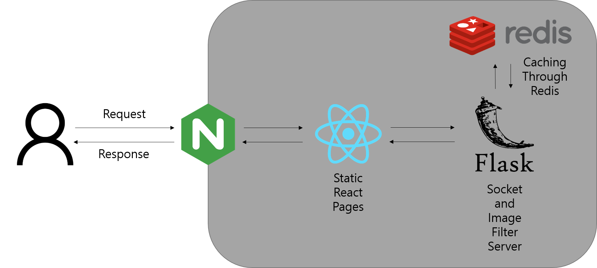
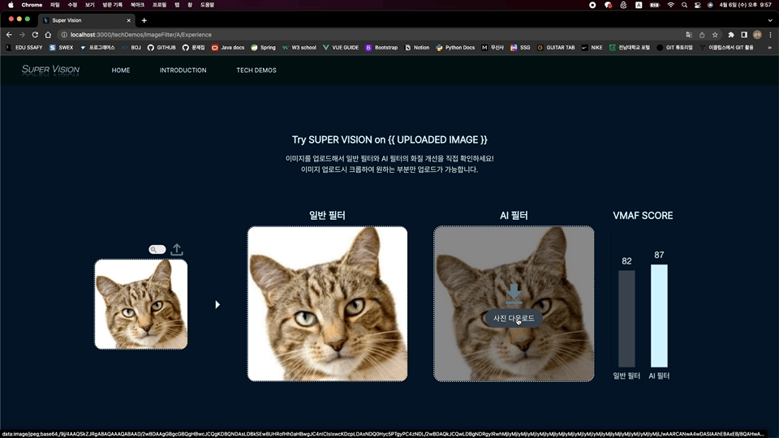
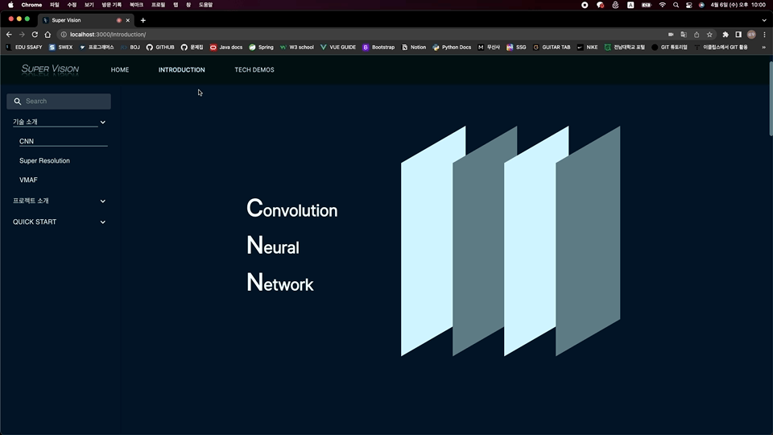
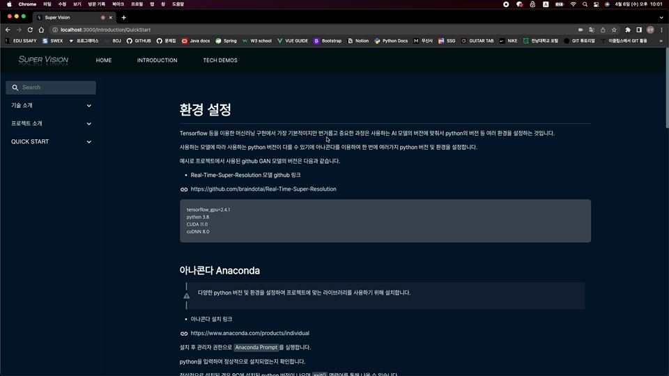

# Super Vision

- AI Super Resolution 기반 저화질 사진,영상 복원하는 필터를 개발하고, 이러한 필터의 성능, 활용 방안을 일반인도 쉽게 이해할 수 있도록 웹 소개 사이트 제작

## 개요

Super Vision이라는 프로젝트 이름은 사전상의 의미로 대단한, 굉장히 좋은이라는 의미를 가진 Super와 시야라는 의미의 Vision에서 영감을 얻어 만든 이름입니다.

위와 같은 의미에 걸맞게 저화질의 사진, 영상을 고화질로 변환하는 서비스의 성능과 활용 방안 전달을 목적으로 합니다.

## 팀 소개

### 팀 명 : 코라밸 (Code + Life + Balance : 삶과 코딩의 균형을 추구하는 팀)

<table>
  <tr>
    <td align="center"><a href="https://github.com/rudy0103"><br /><sub><b>박성건 (팀장)<br>Backend & AI</b></sub></a><br /></td>
    <td align="center"><a href="https://github.com/kimkisol"><br /><sub><b>김기솔<br>Frontend</b></sub></a><br /></td>
    <td align="center"><a href="https://github.com/sangwoo420"><br /><sub><b>박상우<br>Backend</b></sub></a><br /></td>
    <td align="center"><a href="https://github.com/Sungayoung"><br /><sub><b>성아영<br>Frontend</b></sub></a><br /></td>
    <td align="center"><a href="https://github.com/sdh98429"><br /><sub><b>신동호<br>AI</b></sub></a><br /></td>
    <td align="center"><a href="https://github.com/Magpie1000"><br /><sub><b>천민우 (부팀장)<br>Frontend</b></sub></a><br /></td>
    </tr>

</table>

## 주요 기능

- AI Super Resolution 기반 체험형 웹 애플리케이션
  - 기술을 처음 접하는 사람도 쉽게 이해할 수 있도록 웹 페이지 구성
- 이미지 Super Resolution 기능 체험
  - 사용자가 이미지를 제공하여 결과물을 보며 기능을 체험할 수 있음
- 자동으로 이미지의 객체를 탐지하여 자른 부분을 Super Resolution 필터를 적용하여 제공
  - 추가적인 기능으로 사용자가 제공한 이미지에서 객체를 추출하여 해당 부분에 대한 Super Resolution 필터를 적용한 결과를 제공
- 실시간 스트리밍에 Super Resolution을 적용하여 결과물 확인
  - 사용자의 웹 캠 스트림에 실시간으로 Super Resolution 필터를 적용하여 확인할 수 있음

## 주요 기술

### Frontend

- React
- Typescript
- WebRTC

### Backend

- Python Flask
- socket.io
- Tensorflow
- Redis

### CI/CD

- Jenkins

## 아키텍처 다이어그램



## 프론트엔드 프로토타입


## 프론트엔드 컴포넌트 구조

```
frontend
  ├── node_modules
  ├── public
  └── src
      ├── app
      ├── Assets
      ├── Components
      │   ├── Bars
      │   ├── Cards
      │   ├── Commons
      │   ├── Dialog
      │   ├── Home
      │   ├── Introduction
      │   └── TechDemos
      ├── feature
      ├── router
      ├── Layout
      ├── Pages
      │   ├── Home
      │   ├── Introduction
      │   └── TechDemos
      │         ├── ImageFilter
      │         └── WebcamFilter
      ├── Router
      └── Theme
```

## API 명세서

### 이미지 필터

- URL : baseURL/image
- Method : POST
- Request Body

```json
{ "image" : 이미지 파일 }
```

- Request Content-Type : multipart/form-data
- Response

```json
{
	"sr_upscaled" : AI Super Resolution upscaled base64 이미지 문자열,
	"normal_upscaled" : 일반 필터 upscaled base64 이미지 문자열,
	"sr_vmaf_score" : AI Super Resolution VMAF 점수,
	"normal_vmaf_score" : 일반 필터 VMAF 점수
}
```

### 객체 탐지

- URL : baseURL/detect
- Method : POST
- Request Body

```json
{ "image" : 이미지 파일 }
```

- Request Content-Type : multipart/form-data
- Response

```json
[
    {
        "class": "person",
        "score": "0.98354924",
        "x1": "224.0",
        "x2": "355.0",
        "y1": "189.0",
        "y2": "467.0"
    },
    {
        "class": "person",
        "score": "0.98132306",
        "x1": "529.0",
        "x2": "618.0",
        "y1": "199.0",
        "y2": "467.0"
    },
    ...
]
```

### 객체 탐지 후 단일 이미지 크롭 및 Super Resolution Upscale

- URL : baseURL/crop
- Method : POST
- Request Body

```json
{
  "coor": {
    "class": "person",
    "score": "0.98132306",
    "x1": "529.0",
    "x2": "618.0",
    "y1": "199.0",
    "y2": "467.0"
  }
}
```

- Request Content-Type : default (application/x-www-form-urlencoded)
- Response

```json
{
	"cropped" : base64 크롭된 이미지 문자열,
	"sr_upscaled" : AI Super Resolution upscaled base64 이미지 문자열,
	"normal_upscaled" : 일반 필터 upscaled base64 이미지 문자열,
	"sr_vmaf_score" : AI Super Resolution VMAF 점수,
	"normal_vmaf_score" : 일반 필터 VMAF 점수
}
```

### 객체 탐지 후 다중 이미지 크롭 및 Super Resolution Upscale

- URL : baseURL/crop-set
- Method : POST
- Request Body

```json
{
	"list" : [
    {
        "class": "person",
        "score": "0.98354924",
        "x1": "224.0",
        "x2": "355.0",
        "y1": "189.0",
        "y2": "467.0"
    },
    {
        "class": "person",
        "score": "0.98132306",
        "x1": "529.0",
        "x2": "618.0",
        "y1": "199.0",
        "y2": "467.0"
    },
    ...
]
}
```

- Request Content-Type : default (application/x-www-form-urlencoded)
- Response

```json
[
	{"cropped_upscaled" : cropped upscaled base64 이미지 문자열}, ...
]
```

## 주요 화면

### 메인 페이지


### 이미지 필터
VMAF : Netflix에서 개발한 비디오 품질 평가 알고리즘


### 이미지 다운로드


### 객체 탐지 기능 이미지 필터


### 웹 캠 필터


### 기술 소개 페이지


### 퀵 스타트 페이지

